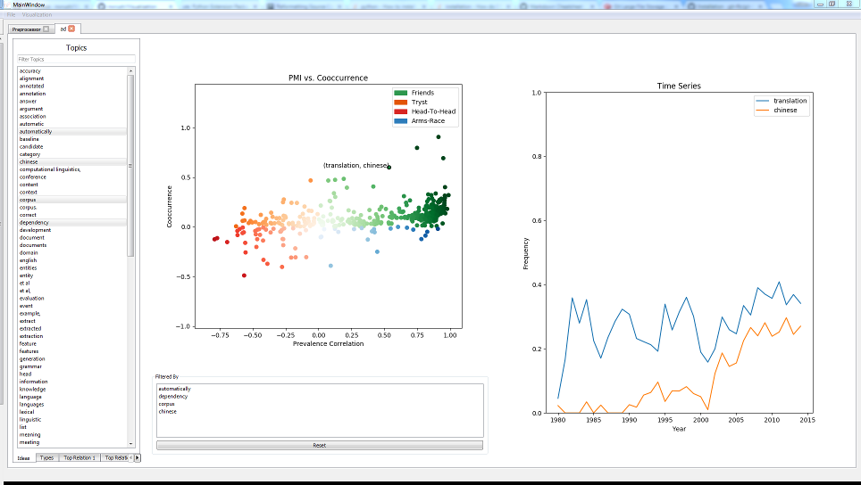

# Visualization

This project is still in active development, but is mostly stable. Various features are subject to appear or disappear with little/no notice.
It's our hope though that the feature set will grow not shrink.

## About

This project builds on the work done by Chenhao Tan and Dallas Card in [this paper](https://chenhaot.com/pages/idea-relations.html). This tool provides a way to visualize text interactively using the relations outlined in the paper.

## Installation
Installing has been tested on Windows (7 and higher) (64-bit), Linux (Centos7), and some version of OSX. For convenience install scripts are provided for windows and linux.

### Requirements
- Python3 (only tested on 3.5 and higher)
- A display
    - Running over a x-server is possibly but does not look good

### Linux Installation
1. Download or clone the repo
2. Change the value of the variables $PYTHONPATH and $VenvPath to point to your system python installation and virtualenv
3. Run `./FullSetup.sh`
    - This will create the application in a new folder called Application
4. Activate the virtualenv (Application/venv)
5. Run the visualizer with: `python Visualizer.py`

### Windows Installation
1. Download or clone the repo
2. Change the value of the variable PythonPath to point to your system python installation
3. Run `FullSetup.bat`
    - This will create the application in a new folder called Application
4. Activate the virtualenv
    - If you called FullSetup.bat from the command line, the virtualenv may already be active
5. Run the visualizer with: `python Visualizer.py`

### Manual Installation
1. Download or clone the repo
2. Run: `git submodule init` and then `git submodule update`
3. Create a new folder where you want to install the application
4. From the folder Visualizer, copy all .py files and all folders to your application folder
6. Copy the top level idea_relations folder into the application folder
7. Create a virtual environment containing the packages listed in the FullRequirements.txt file
8. Activate the virtual environment and run the visualizer with `python Visualizer.py`

### Anaconda Installation
1. Follow the Manual Installation instructions up to step 6
2. Instead of creating a python virtualenv, you can create an anaconda environment containing the packages in Conda_package_list.txt
    - Linux and Windows users can try to use the appropriate spec file
3. Run the program the same as the manual installation instructions

